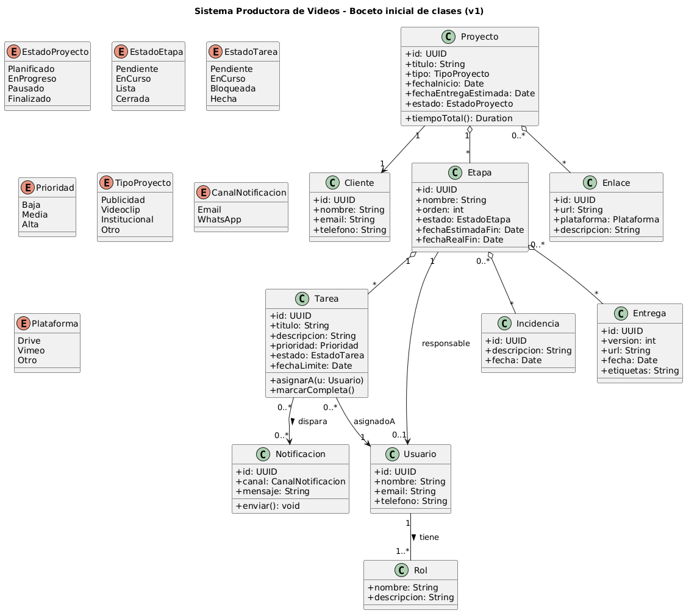

## Casos de uso

A continuación se documentan los actores y cinco casos de uso iniciales del sistema.

### Actores
- **Productora/Coordinadora**: crea proyectos, configura etapas, asigna responsables, consulta KPIs.
- **Editor/Operador**: ejecuta tareas por etapa, sube entregables/versiones, marca avances.
- **Asistente de Producción**: carga datos operativos, comentarios e incidencias, enlaces.
- **Sistema**: gestiona estados, notificaciones (mail/WhatsApp) y métricas/alertas.

---

### CU1 – Crear proyecto y configurar etapas
**Actor principal:** Productora/Coordinadora  
**Descripción:** Crea un proyecto con datos básicos, define etapas estándar (grabación, edición, revisión, publicación) y puede agregar extras (animación, subtitulado). Asigna responsables por etapa.

**Flujo principal:**
1. La Productora selecciona “Nuevo proyecto”.
2. Ingresa cliente, tipo de proyecto y fecha objetivo.
3. Elige plantilla de etapas y agrega/quita etapas extra.
4. Asigna responsable por cada etapa.
5. (Opcional) Agrega enlaces iniciales (Drive/Vimeo).
6. Guarda; el Sistema crea el backlog de etapas.

**Precondiciones:** Usuario con permiso de creación.  
**Postcondiciones:** Proyecto en **Planificado** con etapas y responsables definidos.

---

### CU2 – Avanzar etapa y notificar al siguiente responsable
**Actor principal:** Editor/Operador  
**Descripción:** El responsable marca su etapa como **Completada**; el Sistema activa la siguiente y notifica por mail/WhatsApp.

**Flujo principal:**
1. El Editor abre su etapa activa.
2. Adjunta entregables/versiones finales.
3. Marca la etapa como **Completada**.
4. El Sistema registra tiempos real vs. estimado y demora.
5. El Sistema pone la siguiente etapa en **Listo para iniciar**.
6. El Sistema notifica al siguiente responsable (mail/WhatsApp).

**Precondiciones:** Etapa activa y usuario responsable.  
**Postcondiciones:** Etapa actual **Completada**; siguiente **Listo para iniciar**; métricas y notificación realizadas.

---

### CU3 – Asignar o reasignar tareas dentro de una etapa (uno o varios responsables)
**Actor principal:** Productora/Coordinadora  
**Descripción:** Crea tareas dentro de una etapa, define prioridad y fechas, y asigna uno o varios responsables (p. ej., dos editores en paralelo).

**Flujo principal:**
1. La Productora abre el tablero del proyecto.
2. Crea una o más tareas en una etapa.
3. Define prioridad (alta/media/baja) y fecha estimada.
4. Asigna una o varias personas responsables.
5. Guarda; el Sistema notifica a los asignados.
6. Las tareas quedan visibles con filtros por responsable/estado.

**Precondiciones:** Proyecto y etapa existentes.  
**Postcondiciones:** Tareas creadas/asignadas con prioridad y fechas; notificaciones enviadas.

---

### CU4 – Registrar incidencias y comentarios internos por etapa
**Actor principal:** Cualquier miembro del equipo  
**Descripción:** Registra incidencias (bloqueante/mejora/consulta) y comentarios con evidencia (archivos/enlaces), dejando histórico y trazabilidad.

**Flujo principal:**
1. El usuario abre “Incidencias/Comentarios” de la etapa.
2. Redacta el comentario o describe la incidencia.
3. (Opcional) Adjunta evidencia o enlace.
4. Etiqueta el tipo (bloqueante/mejora/consulta).
5. Guarda el registro.
6. El Sistema notifica a la persona responsable de la etapa.

**Precondiciones:** Acceso al proyecto/etapa.  
**Postcondiciones:** Incidencia/comentario registrado y notificado; visible en histórico.

---

### CU5 – Consultar tablero y estadísticas operativas
**Actor principal:** Productora/Coordinadora  
**Descripción:** Visualiza proyectos activos, tareas pendientes, tiempos reales vs. estimados y totales mensuales filtrables por cliente y tipo de proyecto; permite exportar/compartir reportes.

**Flujo principal:**
1. La Productora abre el tablero general.
2. Aplica filtros (cliente, tipo, responsable, estado).
3. Revisa KPIs: proyectos activos, % avance, tareas vencidas.
4. Abre reportes con totales del mes y tiempos por etapa.
5. Exporta o comparte reporte (PDF/CSV o enlace interno).
6. (Opcional) Programa envío automático mensual.

**Precondiciones:** Existencia de datos de proyectos/etapas.  
**Postcondiciones:** Información de seguimiento disponible; reportes generados/compartidos.

**DIAGRAMA DE CASO DE USOS:**

[Ver código PlantUML](../diagramas/01-diagrama-clases/01-boceto-inicial.puml)

